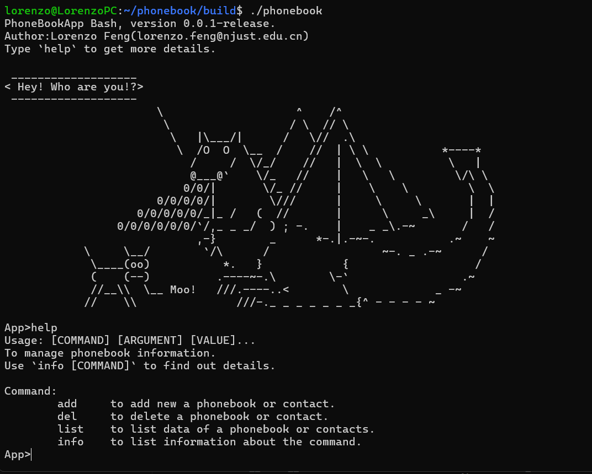

# phonebook

用于帮助管理电话簿数据的bash应用程序。



## 部署

在终端运行如下指令即可安装

``` bash
git clone https://github.com/7emotions/phonebook.git
cd phonebook
mkdir build
cd build
cmake ..
make
./phonebook #运行
```

> 注意：编译依赖CMake与Make等工具。

## 使用

键入`help`查阅使用手册。

```
App>help
Usage: [COMMAND] [ARGUMENT] [VALUE]...
To manage phonebook information.
Use `info [COMMAND]` to find out details.

Command:
        add     to add new a phonebook or contact.
        del     to delete a phonebook or contact.
        list    to list data of a phonebook or contacts.
        info    to list information about the command.
```

在命令之前键入`info`查阅该命令的详细说明。

```
App>info list
Usage:
        list <book|contact> [name]
Options:
        book            List all phonebooks
        contact         List all contacts in phonebook named [name]
```

## 功能
- 多电话簿管理
- 命令行操作

## 贡献者
项目暂无其他贡献者，期待您的PR。

## 版权
本项目使用MIT开源许可证，参考[MIT License](./LICENSE)。

## 通讯
任何有关项目疑问，欢迎Mail至 [lorenzo.feng@njust.edu.cn]()。